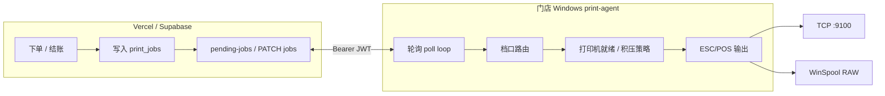
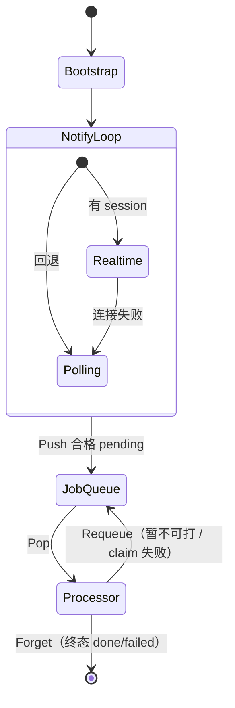
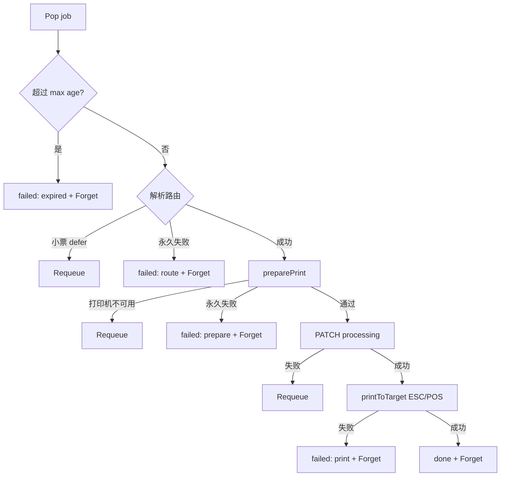

# Mesa 打印全链路说明

本文描述当前仓库中 **云端 `print_jobs` 队列** 与 **本地 print-agent（Go）** 的协作方式，对应 agent 版本 **0.3.19+** 行为。

相关代码：

- 云端：`src/lib/station-ticket-enqueue.ts`、`src/lib/order-receipt-enqueue.ts`、`src/app/api/print-agent/*`
- Agent：`apps/print-agent/agent_run.go`、`processor.go`、`job_queue.go`、`polling.go` / `realtime.go`、`printer_readiness.go`、`config.go`、`sink*.go`

---

## 1. 开发约束：Windows / WinSpool 就绪判断（必读）

修改 `apps/print-agent` 时，**不得**恢复「读 Windows 打印机状态位 → 判定不可打印」一类逻辑。USB 热敏机（含 POS-80）经常在**能正常 RAW 出纸**时仍上报 `PRINTER_STATUS_OFFLINE`（例如合并状态 **0xC0** = OFFLINE \| PAPER_PROBLEM），会导致任务永远 `pending`、日志里反复 `not ready (status 0xC0)`。

### 禁止（勿再引入）

| 反模式 | 典型代码 / API | 后果 |
|--------|----------------|------|
| 预检读 `PRINTER_STATUS_*` | `GetPrinter` level 6/8 → `winspoolDiagnosticStatus` → **`winspoolStatusIsProblem(flags)`** → `winspoolCheckReady` 返回 not ready | 0.2.60+ 整批不打印；与物理打印机是否正常无关 |
| 把 OFFLINE / NOT_AVAILABLE 当硬故障 | `flags & (PRINTER_STATUS_OFFLINE \| …)` 在 **claim 之前** 拦截 | 误报 0xC0；积压与在线单都打不出去 |
| 预检用 `JOB_STATUS_OFFLINE` / `BLOCKED` | 在 `preparePrint` / `winspoolCheckReady` 路径查作业状态 | 同类误报 |
| 仅因状态位标 `wasOffline` | 未发生 `OpenPrinter` / `Write` 失败就持久化离线 | 已删除（0.3.19 无离线积压） |

历史：print-agent **0.2.59** 及更早仅 `OpenPrinter` + RAW；**0.2.60** 起引入上述状态位预检后出现现场故障；**0.3.9+** 已从预检路径移除 `winspoolStatusIsProblem`；**0.3.11** 起打印 IO 失败统一走 `printerIOFailure` / `notePrintFailure`。

### 允许（当前约定）

| 阶段 | WinSpool | TCP |
|------|----------|-----|
| **能否开始打（预检）** | `winspoolCheckReady` = **`OpenPrinter` 成功**（`sink_winspool_windows.go`），不读 `PRINTER_STATUS_*` | `Dial` 2s（`tcpCheckReady`） |
| **物理输出** | `WritePrinter` / RAW；失败包装为 `errPrinterNotReady` 或经 `printerIOFailure` 记离线 | `Write`；失败同上 |
| **提交后校验（可选）** | 仅 `winspoolJobStatusIsProblem` 且 **只认 `JOB_STATUS_ERROR`**（`winspool_job_status.go`），用于 RAW 提交后轮询，**不**用于 `preparePrint` | 无作业状态 API |

**0.3.19+** 已移除 `print_after` 离线积压策略；每单仅 `preparePrint`（TCP Dial / WinSpool Open）→ 打印 → 成功 `done` / 预检失败 `pending` / IO 失败 `failed`。

### Code review 自检

- [ ] `winspoolCheckReady` 内没有 `GetPrinter`、`winspoolStatusIsProblem`、`winspoolDiagnosticStatus`
- [ ] 不存在仅因 `PRINTER_STATUS_OFFLINE` / `0xC0` 返回 `errPrinterNotReady` 的分支
- [ ] `preparePrint` 之前没有 `JOB_STATUS_*` 预检
- [ ] 若新增「就绪」辅助函数，命名上不要与已删除的 `winspool_status.go` 混淆；逻辑上仍以 **Open + Write 结果** 为准

相关实现注释：`printer_io_errors.go`、`sink_winspool_windows.go` 中 `winspoolCheckReady`。

### 1.1 立案：同类「误报 / 代理信号」问题（统一记录在案）

以后凡 **「打印机到底在不在线」**、**「离线积压要不要打」**、**「任务为何 failed / pending / 误标 done」**，先查本节，不要重复引入已被否定的探测方式。

#### 两难：没有可靠的布尔「在线」

USB 热敏（如 POS-80）在 Windows 上同时存在 **两种相反误报**，无法靠单一 API 既避免 0xC0 又不被 spooler 骗：

| 信号 | 典型现象 | 若当成硬规则的后果 |
|------|----------|-------------------|
| `PRINTER_STATUS_OFFLINE` 等状态位 | 真插着、能出纸仍报 **0xC0** | 永远 `pending`、日志 `not ready (status 0xC0)`（**0.2.60+**，见上表禁止项） |
| 仅 `OpenPrinter` / RAW 进 spooler | **USB 未插** 也常成功 | 任务标 `done`、日志「已打印」，纸无输出 |
| `WritePrinter` 失败 | 较接近真实断线 | 依赖 IO 失败才记 `wasOffline`；拔线瞬间可能仍成功写入 spooler |
| TCP `Dial` | LAN 相对可信 | 仅适用于网口机；与 WinSpool USB 问题无关 |

**结论**：产品上要的三件事互相拉扯——(1) 离线期间不自动补打积压；(2) 恢复后新单立刻打；(3) 冷启动且打印机已插着时不误杀。在 WinSpool USB 上只能用 **时间戳 `print_after` + 会话内 `online_confirmed` + 真实 `was_offline→在线` / 打印成功** 组合近似，**任何「单次探测 = 上线」的假设都会翻车**。

#### 案例：0.3.12 `armPrintAfterOnPendingFetch`（禁止再犯）

| 误把什么当成什么 | 实际代码行为（0.3.12） | 现场表现 |
|------------------|------------------------|----------|
| 「第一次从 Mesa 拉到 pending」→「打印机刚上线」 | `OpenPrinter` 成功时 `printAfter = 拉队列时刻` | 仅 **created_at 早于该时刻** 的单 → `failed:offline_backlog`；**之后的单** 当「上线后新单」→ 进 spooler 并标 **done**（纸可能仍未出） |
| `OpenPrinter` 成功 →「打印机真的可达」 | 未区分 Mesa 可达与 USB 物理在线 | 用户日志：14:32:41 已能拉队列；14:32:30 单 failed（积压跳过）；14:33 后多单「已打印」——**不是 Mesa 断连**（断连时 agent 通常 PATCH 不了任务，也不会用 offline_backlog 文案） |

**根因一句话**：在无法可靠知道 USB 是否插着时，用 **「首次拉队列 + OpenPrinter」** 作为 **「打印机上线时刻」**——代理指标与业务事件绑错。

**0.3.13+ 修正方向**（实现见 `printer_readiness.go` §7.3）：

- WinSpool：`OpenPrinter` 成功 **不再** 把「拉队列时刻」当作上线；`printAfter` 用 **agent 启动时刻** 或 **探测失败时的 now**；`online_confirmed` 仅在 **本会话打印成功** 后为真；未确认前 `preparePrint` → `pending`（`errPrinterNotReady`），避免误标 done。
- TCP：探测成功可较早 `online_confirmed=true`（Dial 比 OpenPrinter 可信）。

**0.3.14 补丁（仍显示 0.3.13 却照打）**：

- **勿** 从磁盘 `printer_print_after` 推断 `online_confirmed=true`（旧逻辑会导致重启后 `arm` 被跳过、直接标 done）。
- 每次 agent 启动对 WinSpool 执行 `resetWinspoolSessionTrust`；`observe` 恢复 **不再** 自动 `online_confirmed=true`（仅 `markPrintAfter` + 日志）。
- 日志：`WinSpool 本会话尚未确认真机在线，任务保持等待（打印机 …，单号 …）`。

**禁止（与 §1 禁止表并列，勿再引入）**：

| 反模式 | 后果 |
|--------|------|
| 首次拉 pending 且 `OpenPrinter` 成功 → `printAfter = now()` 并当作「已上线」 | 「第一条 failed、后面全 done」|
| 仅凭 `OpenPrinter` 成功即 `online_confirmed = true`（WinSpool） | 未插 USB 仍标 done |
| 恢复读 `PRINTER_STATUS_*` 解决「未插也 Open 成功」 | 回到 0xC0 整批不打 |

#### 日志：区分 Mesa 断连 vs 打印机策略（排障清单）

| 日志 / PATCH | 含义 | 是否打印机物理离线 |
|--------------|------|-------------------|
| `无法连接 Mesa 拉取…` / `心跳上报失败` | 云端/API 网络 | 否；任务多为 **pending**，agent 改不了状态 |
| `拉取到待打印队列，跳过此前积压（打印机 …）` | `armPrintAfterOnPendingFetch` | 不一定；只表示 **积压分界已 arm** |
| `已跳过打印机恢复前的积压（单号 …）` + `failed:offline_backlog` | `errPrintJobSkippedBacklog` | **是策略跳过**，不是 Mesa 断连 |
| `打印机不可达 […]` + 任务仍 **pending** | `errPrinterNotReady` | 探测/准备阶段认为不可打 |
| `已打印：…` + `done` | 物理路径认为成功 | 若纸无输出，查是否 0.3.12 类误标或 spooler 假成功 |

**决策日志（0.3.15+，`log_readiness`）**：每条以 `就绪决策 [事件]` 开头，括号后为 `key=value` 字段，便于 grep：

| 字段 | 含义 |
|------|------|
| `event=` | `session_init` / `arm_pending` / `observe` / `prepare_job` / `confirm_print` / `io_offline` / `remap` |
| `target=` | `winspool:…` 或 `tcp:host:port` |
| `check=` | `open_ok` / `open_fail` / `tcp_ok` / `tcp_fail` |
| `online_confirmed=` | 本会话是否允许标 `done` |
| `was_offline=` | 当前是否记为离线 |
| `print_after=` | 积压分界（RFC3339 或 `-`） |
| `agent_started=` | 本会话启动时刻 |
| `arm_reason=` | 如 `first_pending_open_ok`、`print_after_already_set`、`session_start` |
| `decision=` | 如 `allow_print`、`pending_unconfirmed`、`skip_backlog`、`confirm_online_after_print` |
| `mesa_patch=` | 预期云端状态：`pending` / `failed:offline_backlog` / `done` |
| `job_id=` / `job_created=` | 任务标识（有则带） |

**判因示例**：未插 USB 却标 done → 搜 `decision=allow_print` 且同条 `online_confirmed=true`（不应出现）；应见 `decision=pending_unconfirmed` + `mesa_patch=pending`。

#### 1.2 WinSpool 离线探测标定（0.3.18+，只记日志、不改门控）

**目的**：用现场日志对比「USB 插着 / 拔掉」时哪些 Win32 字段真的变，再**只采纳一种**作为离线依据；不再靠 `online_confirmed` 等补丁试。

每次 `observe`（约每几秒一次）在 `就绪决策 [observe]` 行追加 **只读** 字段：

| 字段 | 含义 |
|------|------|
| `open` | `OpenPrinter` 成败 |
| `get_printer` | `GetPrinter` level 2 成败 |
| `printer_status` | `PRINTER_STATUS_*` 合并值（**插入时也可能 0xC0，禁止单独作门控**） |
| `printer_attributes` | 队列属性 |
| `flag_attr_work_offline` | `PRINTER_ATTRIBUTE_WORK_OFFLINE` |
| `flag_status_offline` / `flag_status_paper_problem` | 常见误报位，仅作对照 |
| `port_name` | 如 `USB001` |

**请你协助采集（各 2 分钟，agent 0.3.18+）**：

1. **USB 拔掉**：下单 1 张 → 复制 3～5 条 `event=observe` 行。  
2. **USB 插上且能出纸**：再下单 1 张 → 同样复制 observe 行。  
3. 发两组日志；我们对比哪几个字段 **稳定不同**。

标定完成前，**业务门控仍只有**：`OpenPrinter`/TCP 失败 → pending；`created_at < print_after` → failed；否则尝试打印。

#### 修改离线/就绪逻辑时的 Code review 追加项

- [ ] 是否把 **Mesa 拉到队列** 与 **打印机物理上线** 混为一谈？
- [ ] WinSpool 是否在 **未** `was_offline→在线` 且 **未** 打印成功时标 `done`？
- [ ] 是否用 `PRINTER_STATUS_*` / `JOB_STATUS_OFFLINE` 做 **claim 前** 拦截？（禁止）
- [ ] 失败单文案是 `offline_backlog` 还是网络错误？是否与用户描述的「没插打印机」一致？

---

## 2. 架构概览

- **云端**只负责排队、鉴权、状态机、**10 分钟**过期；不直接连打印机。
- **Agent** 持有 `agentjwt`，按餐厅 `restaurant_id` 拉取本店 `pending` 任务，映射到本地 `config.json` 里的档口打印机，再物理打印。

---

## 3. 任务类型与入队（云端）

| `type` | 触发场景 | `payload` 路由关键字段 |
|--------|----------|------------------------|
| `station_ticket` | 顾客/服务员提交订单批次 | `print_station_id` → 档口 UUID |
| `order_receipt` | 结账小票（`receipt_variant`：`split_payment` / `final` / `checkout_bill`） | `receipt_printer_id`（通常 `station:{档口UUID}`） |
| `pre_bill` | 预结单（`receipt_variant`：`pre_bill`） | 同上 |

入队函数：

- 厨房档口：`enqueueStationTicketsForOrder`（`src/lib/station-ticket-enqueue.ts`）
- 小票：`enqueueReceiptPrint`（`src/lib/order-receipt-enqueue.ts`）

写入表 `print_jobs`：`status = pending`，`created_at` 为服务器时间（agent 积压判断依赖此字段）。

**桌台身份**：payload 含 `table_id`（UUID）与 `display_name`（纸质显示名）；小票/厨打不得把 UUID 打到纸上。

---

## 4. Agent API（云端）

| 方法 | 路径 | 作用 |
|------|------|------|
| `POST` | `/api/print-agent/claim` | 配对，下发 `agentjwt` |
| `GET` | `/api/print-agent/pending-jobs` | 拉取待打印（最多 25 条，按 `created_at` 升序） |
| `PATCH` | `/api/print-agent/jobs/:id` | 更新 `processing` / `done` / `failed` |
| `POST` | `/api/print-agent/heartbeat` | 在线心跳、最近打印结果 |
| `PUT` | `/api/print-agent/routing` | 同步档口映射（Dashboard 配置） |

### 4.1 `GET pending-jobs` 过滤规则

每次请求会：

1. 校验 `Authorization: Bearer <agentjwt>`，解析 `restaurant_id`、`device_id`。
2. 调用 `expireStalePrintJobs`：将超时 `pending`/`processing` 标为 `failed`。
3. 只返回 **`created_at` 在最近 10 分钟内** 且 `status = pending` 的本店任务。

因此：断线很多天后的旧单不会再次被拉取；与 agent 侧 10 分钟防御性过期一致。

### 4.2 `PATCH jobs/:id` 状态机

| 目标状态 | 允许的前置 | 副作用 |
|----------|------------|--------|
| `processing` | `pending` | `attempts++`，`claimed_by = device_id` |
| `done` | `processing` | 完成 |
| `failed` | `processing`（或约定路径） | 必须带 `error_message` |

Agent 在**确认可以打印之后**才 PATCH `processing`，避免长时间占用 `processing`。

---

## 5. 本地配置（`config.json`）

路径：`%USERPROFILE%\.config\mesa-print-agent\config.json`（见 `apps/print-agent/README.md`）。

| 字段 | 含义 |
|------|------|
| `api_base` | Mesa 站点 URL |
| `agentjwt` | 配对令牌 |
| `restaurant_id` | 当前绑定餐厅（换店后 Agent 清空 `station_printers` 并重配） |
| `device_id` | 设备 UUID |
| `station_printers` | `{ "<print_station_uuid>": "<printer_addr>" }` |
| `schedule` / `poll` | 营业时间、轮询间隔（云端 `runtime-config` 可覆盖） |
| `printer_print_after` | 每台打印机目标的「恢复在线」时间（RFC3339），用于跳过离线积压 |
| `printer_was_offline` | 持久化离线标记，重启后仍能触发「恢复在线」逻辑 |

### 5.1 打印机地址格式

| 写法 | 协议 | 示例 |
|------|------|------|
| `tcp:host:port` | LAN ESC/POS | `tcp:192.168.1.50:9100` |
| `winspool:队列名` | Windows 本地队列 RAW | `winspool:POSPrinter POS-80` |
| `host:port` / 裸队列名 | 兼容旧配置 | 分别解析为 tcp / winspool |

Agent 内部统一为 `printerTarget`，**目标键** `targetKey`：

- TCP → `tcp:<host:port>`
- WinSpool → `winspool:<队列名>`

---

## 6. 运行时主路径（Notifier + Processor）

并行循环（均由 `runNotificationLoop` 启动）：

| 循环 | 职责 |
|------|------|
| **Notifier** | Realtime 推送或 Polling 拉 `pending-jobs` → `jobEligibleForQueue` → `JobQueue.Push` |
| **JobProcessor** | `Pop` → 过期/路由/`preparePrint`/claim/打印 → 终态 `Forget`；暂不可打或 claim 失败 → `Requeue` |
| **HeartbeatLoop** | 每 5 分钟 `POST /api/print-agent/heartbeat`（设备存活，不是拉单） |
| **ScheduleLoop** | 本地营业闸门；歇业清空队列并 `Forget` 去重，托盘黄灯；**进入营业时间**时请求 Realtime reconcile（同重启后的 pending 补拉） |

**Realtime 漏接兜底（compensation cadence）**：连接健康时按 `poll.warm_interval_sec`（云端 runtime-config）周期性跑与重启相同的 `GET pending-jobs` 入队；连续失败会断开重连。这不是第二套业务轮询，而是与 reconnect/restart 同一条补偿路径。

**托盘语义**：`tray: ready` 仅表示托盘 UI 已起；`tray: Connected` / 日志「已连接」之后才接受打印任务。Bootstrap（runtime-config / routing-sync）使用带超时的 HTTP，并打阶段耗时日志。

入队资格（`config.jobEligibleForQueue`，Realtime 事件 / 补偿拉取 / Polling **同一规则**）：可路由，或窗口内小票 `errReceiptPrintDeferred`。

云端 `runtime-config`（营业时段/轮询间隔）仅在 **进程启动** 合并；改 Dashboard 后需重启托盘。

---

## 7. 单任务流水线

### 7.1 过期

- 云端拉单已过滤；agent 仍对队首做 `jobPrintExpired`（`job_max_age.go`），双保险标 `failed:expired`。

### 7.2 路由（`config.printerTargetForJob`）

| 类型 | 规则 |
|------|------|
| `station_ticket` | `station_printers[print_station_id]` |
| `order_receipt` / `pre_bill` | `receipt_printer_id` → `station:{id}` 查映射；若为空且任务在 defer 窗口内且无映射 → `errReceiptPrintDeferred`（保持 `pending`，`Requeue`） |

### 7.3 打印前预检（`printer_readiness.go`）

每单调用 `preparePrint(target)` → `targetCheckReady`：

- **TCP**：2s 内 `Dial` 成功；失败 → `errPrinterNotReady`，`Requeue`（云端仍 `pending`）。
- **WinSpool**：`OpenPrinter` 成功即可（细则见 **§1**）；失败同上。

无 `print_after` / `online_confirmed` / 磁盘离线标记。**网线**探测相对可信；**USB** 仍可能 Open 成功但纸未出，见 §1.1。

#### 本地队列生命周期（`JobQueue`）

| 操作 | 含义 |
|------|------|
| `Push` | Notifier 首次发现；`seen` 去重 |
| `Pop` | Processor 取出；`seen` 仍保留 |
| `Requeue` | 暂不可打 / claim 失败后回队（不受 `seen` 阻挡） |
| `Forget` | 终态或歇业丢弃后允许同 id 再次 `Push`（含 Dashboard Retry） |

### 7.4 打印执行（`printToTarget`）

| 协议 | 实现 | 就绪检查 |
|------|------|----------|
| TCP | `tcpPrint` 直写 socket | 连接探测 |
| WinSpool | `OpenPrinter` → `RAW` / `XPS_PASS` → `WritePrinter` | 仅 `OpenPrinter` 预检；提交后仅 `JOB_STATUS_ERROR`（见 **§1**） |

成功 → `done` + 心跳 `last_print_status=done`；失败 → `failed:print`。终态后 `Forget`，便于同 id Retry。

---

## 8. 任务结局对照表

| Agent 行为 | `print_jobs.status` | 典型 `error_message` / 备注 |
|------------|---------------------|-----------------------------|
| 打印成功 | `done` | — |
| 超时 | `failed` | `print job expired (older than 10 minutes)` |
| 路由错误 | `failed` | 无映射、不支持的 type 等 |
| 小票暂无可映射打印机 | 保持 `pending` | defer 窗口内 `Requeue` |
| 打印机不可达 | 保持 `pending` | `Requeue`；日志「打印机不可达」 |
| 打印 IO 失败 | `failed` | WinSpool / TCP 具体错误 |
| PATCH 失败 | 可能仍为 `pending`/`processing` | 日志 `job_still_pending` / `print_*_stuck`；claim 失败则 `Requeue` |

人工重打：Dashboard **Retry** 将同一 `id` 重置为 `pending`（见 `print-jobs/[id]/retry` API）；agent `Forget` 后可再次 `Push`。

---

## 9. 与版本相关的行为变更（摘要）

| 版本区间 | 行为 |
|----------|------|
| ≤ print-agent **0.2.59** | WinSpool 仅 `OpenPrinter` + RAW，不读 Windows 状态位 |
| **0.2.60+** | 引入 `PRINTER_STATUS_OFFLINE` 预检 → USB 误报 0xC0 导致整批不打印 |
| **0.3.x** | 轮询前 `preparePrint`；离线积压逻辑；但 `everReady` 导致 **重启 agent 不打 printAfter**，积压仍会打印 |
| **0.3.10+** | 去掉状态位预检；`printer_print_after` / `printer_was_offline` 持久化；去掉 `everReady` 门槛 |
| **0.3.11+** | TCP/WinSpool 写入失败记离线；`printerIOFailure` 统一判断；作业状态不再看 `BLOCKED` |
| **0.3.12** | 首次拉 pending 时 `OpenPrinter` 成功则 `printAfter=拉取时刻` → 易「首条 failed、后续误标 done」（见 **§1.1**） |
| **0.3.13** | WinSpool：`online_confirmed` + `agentStartedAt` arm；未确认前保持 pending（但有磁盘 `print_after` 误确认漏洞） |
| **0.3.14+** | 去掉磁盘误确认；每会话重置 WinSpool trust；仅打印成功 `confirmOnline` |
| **0.3.15–0.3.18** | `print_after` / `online_confirmed` / `log_readiness`（已废弃，见 §1.1 历史） |
| **0.3.19+** | 移除离线积压与就绪状态机；仅 `preparePrint` + 打印结果 |
| **0.3.50+** | 删除不可达的单体 `runPollLoop`；队列统一 `Push`/`Requeue`/`Forget`；入队资格三路径一致 |

---

## 10. 已知边界（非状态位类）

| 场景 | 行为 |
|------|------|
| 拔线但 `OpenPrinter`/TCP 仍成功 | WinSpool 可能 spooler 假成功并标 `done`；网线以 TCP 失败为准 |
| 预检失败 | 任务保持 `pending`，本地 `Requeue`，日志「打印机不可达」 |
| 试打 / 设置页测试 | 不经 `preparePrint` |
| Mesa API 超时 | 拉单/心跳失败，与打印机预检无关 |

---

## 11. 运维与测试建议

1. **网线**：拔网线 → 下单 → 预检应 pending；接回后应能打印。
2. **USB**：拔线行为不可靠；以实际出纸与 Dashboard Retry 为准。
3. **重打旧单**：用 Dashboard Retry（同 id 回 pending）；agent 终态后会 `Forget`，无需重启即可再入队。

---

## 12. 文件索引（Agent）

| 文件 | 职责 |
|------|------|
| `agent_run.go` | `runNotificationLoop`、营业闸门、心跳 |
| `processor.go` | 单任务流水线、Requeue/Forget |
| `job_queue.go` | 本地队列与去重 |
| `polling.go` / `realtime.go` | 任务发现（互斥；Realtime 失败回退 Polling） |
| `printer_readiness.go` | `preparePrint` / 就绪探测 |
| `job_route.go` | 日志用档口 ID |
| `config.go` | 路由解析、`mappedPrinterTargets` |
| `receipt_defer.go` | 小票 defer、`jobEligibleForQueue` |
| `job_max_age.go` | 客户端过期判断 |
| `sink_winspool_windows.go` | Windows RAW 打印（`winspoolCheckReady` 仅 OpenPrinter） |
| `printer_io_errors.go` | IO 失败判定；注释禁止 PRINTER_STATUS 预检 |
| `winspool_job_status.go` | 提交后仅 `JOB_STATUS_ERROR` |
| `sink_tcp.go` | LAN 打印 |
| `main.go` | HTTP 拉单/改状态、子命令入口 |

---

*文档随 `apps/print-agent` 实现更新；若行为变更请同步修改本文与 `apps/print-agent/README.md`。*
