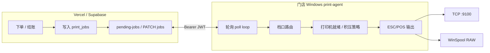
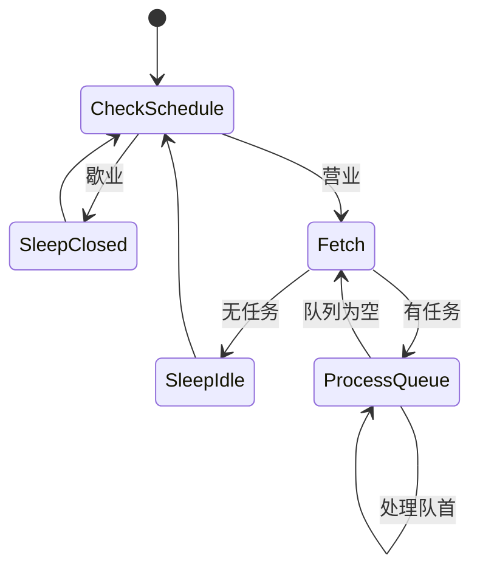
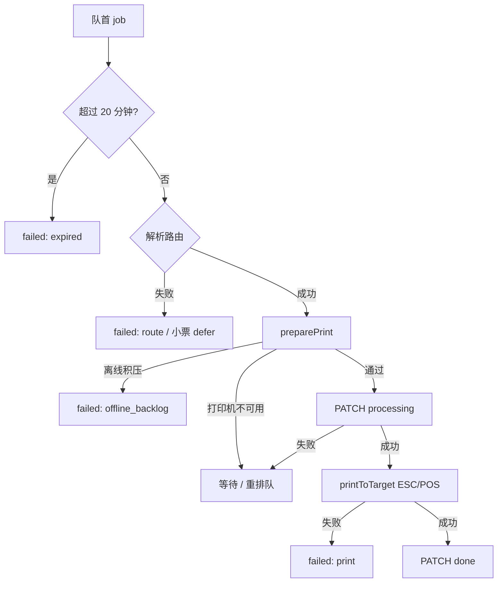

# Mesa 打印全链路说明

本文描述当前仓库中 **云端 `print_jobs` 队列** 与 **本地 print-agent（Go）** 的协作方式，对应 agent 版本 **0.3.11+** 行为。

相关代码：

- 云端：`src/lib/station-ticket-enqueue.ts`、`src/lib/order-receipt-enqueue.ts`、`src/app/api/print-agent/*`
- Agent：`apps/print-agent/agent_poll.go`、`printer_readiness.go`、`config.go`、`sink*.go`

---

## 1. 架构概览

- **云端**只负责排队、鉴权、状态机、20 分钟过期；不直接连打印机。
- **Agent** 持有 `agentjwt`，按餐厅 `restaurant_id` 拉取本店 `pending` 任务，映射到本地 `config.json` 里的档口打印机，再物理打印。

---

## 2. 任务类型与入队（云端）

| `type` | 触发场景 | `payload` 路由关键字段 |
|--------|----------|------------------------|
| `station_ticket` | 顾客/服务员提交订单批次 | `print_station_id` → 档口 UUID |
| `order_receipt` | 结账小票（最终单） | `receipt_printer_id`（通常 `station:{档口UUID}`） |
| `pre_bill` | 预结单 | 同上 |

入队函数：

- 厨房档口：`enqueueStationTicketsForOrder`（`src/lib/station-ticket-enqueue.ts`）
- 小票：`enqueueReceiptPrint`（`src/lib/order-receipt-enqueue.ts`）

写入表 `print_jobs`：`status = pending`，`created_at` 为服务器时间（agent 积压判断依赖此字段）。

**桌台身份**：payload 含 `table_id`（UUID）与 `display_name`（纸质显示名）；小票/厨打不得把 UUID 打到纸上。

---

## 3. Agent API（云端）

| 方法 | 路径 | 作用 |
|------|------|------|
| `POST` | `/api/print-agent/claim` | 配对，下发 `agentjwt` |
| `GET` | `/api/print-agent/pending-jobs` | 拉取待打印（最多 25 条，按 `created_at` 升序） |
| `PATCH` | `/api/print-agent/jobs/:id` | 更新 `processing` / `done` / `failed` |
| `POST` | `/api/print-agent/heartbeat` | 在线心跳、最近打印结果 |
| `PUT` | `/api/print-agent/routing` | 同步档口映射（Dashboard 配置） |

### 3.1 `GET pending-jobs` 过滤规则

每次请求会：

1. 校验 `Authorization: Bearer <agentjwt>`，解析 `restaurant_id`、`device_id`。
2. 调用 `expireStalePrintJobs`：将超时 `pending`/`processing` 标为 `failed`。
3. 只返回 **`created_at` 在最近 20 分钟内** 且 `status = pending` 的本店任务。

因此：断线很多天后的旧单不会再次被拉取；与 agent 侧 20 分钟防御性过期一致。

### 3.2 `PATCH jobs/:id` 状态机

| 目标状态 | 允许的前置 | 副作用 |
|----------|------------|--------|
| `processing` | `pending` | `attempts++`，`claimed_by = device_id` |
| `done` | `processing` | 完成 |
| `failed` | `processing`（或约定路径） | 必须带 `error_message` |

Agent 在**确认可以打印之后**才 PATCH `processing`，避免长时间占用 `processing`。

---

## 4. 本地配置（`config.json`）

路径：`%USERPROFILE%\.config\mesa-print-agent\config.json`（见 `apps/print-agent/README.md`）。

| 字段 | 含义 |
|------|------|
| `api_base` | Mesa 站点 URL |
| `agentjwt` | 配对令牌 |
| `device_id` | 设备 UUID |
| `station_printers` | `{ "<print_station_uuid>": "<printer_addr>" }` |
| `schedule` / `poll` | 营业时间、轮询间隔（云端 `runtime-config` 可覆盖） |
| `printer_print_after` | 每台打印机目标的「恢复在线」时间（RFC3339），用于跳过离线积压 |
| `printer_was_offline` | 持久化离线标记，重启后仍能触发「恢复在线」逻辑 |

### 4.1 打印机地址格式

| 写法 | 协议 | 示例 |
|------|------|------|
| `tcp:host:port` | LAN ESC/POS | `tcp:192.168.1.50:9100` |
| `winspool:队列名` | Windows 本地队列 RAW | `winspool:POSPrinter POS-80` |
| `host:port` / 裸队列名 | 兼容旧配置 | 分别解析为 tcp / winspool |

Agent 内部统一为 `printerTarget`，**目标键** `targetKey`：

- TCP → `tcp:<host:port>`
- WinSpool → `winspool:<队列名>`

---

## 5. 轮询主循环（`runPollLoop`）

每圈大致顺序：

1. `reloadAgentSessionConfig`：读取磁盘配置；若档口映射变更，触发 **换打印机积压策略**（见 §6.3）。
2. 判断营业时间 `scheduleOpen`；歇业则不拉单。
3. `postHeartbeat`。
4. 本地队列 `queue` 为空时 `fetchPending`；否则继续消化队首（一批拉取后顺序处理，减少 API 压力）。
5. 对队首任务走 **单任务流水线**（§6）。
6. 按 `poll` 配置休眠：`busy` / `after_print` / `idle` / `warm` / `error` / `closed`。

**启动时**：`printerReady().bootstrap(sess)` 探测所有已映射打印机；不可达则记 `wasOffline` 并写入 `printer_was_offline`。

---

## 6. 单任务流水线

### 6.1 过期（20 分钟）

- 云端拉单已过滤；agent 仍对队首做 `jobPrintExpired`（`job_max_age.go`），双保险标 `failed:expired`。

### 6.2 路由（`config.printerTargetForJob`）

| 类型 | 规则 |
|------|------|
| `station_ticket` | `station_printers[print_station_id]` |
| `order_receipt` / `pre_bill` | `receipt_printer_id` → `station:{id}` 查映射；若为空且任务 **20 分钟内** 且无映射 → `errReceiptPrintDeferred`（保持 `pending`，不标 failed） |

### 6.3 打印机就绪与离线积压（`printer_readiness.go`）

**设计目标**：打印机离线期间产生的任务，在 **恢复在线之后不要自动补打**；恢复之后新下的单正常打印。

#### 状态（每台 `targetKey`）

| 状态 | 含义 |
|------|------|
| `wasOffline` | 当前或上次探测认为不可达（内存 + `printer_was_offline` 持久化） |
| `printAfter` | 「恢复在线」时刻（内存 + `printer_print_after` 持久化） |

#### `observeTargetReady`

1. `targetCheckReady`：
   - **TCP**：2s 内 `Dial` 成功。
   - **WinSpool**：`OpenPrinter` 成功即可（**不**根据 `PRINTER_STATUS_OFFLINE` 等易误报状态位拦截，避免 0xC0 假离线）。
2. 失败 → `wasOffline = true`，持久化，返回 `errPrinterNotReady`（任务保持 `pending`）。
3. 成功且此前 `wasOffline` → `markPrintAfter(now)`，打日志「打印机已恢复在线…」，清除 `wasOffline`。

#### `shouldSkipBacklog`

若存在 `printAfter` 且 `job.created_at < printAfter` → `errPrintJobSkippedBacklog` → PATCH `failed`，文案：

`Print job skipped (printer was offline; only jobs created after the printer came online are printed)`

无 `created_at` 时保守跳过。

#### 触发 `printAfter` 的三种情况

1. **离线 → 在线**（上节）。
2. **档口换了打印机**（`noteMappingChanges`）：该目标立即 `markPrintAfter`。
3. **打印过程报 not ready**（`noteTargetOffline`）：下次成功就绪时再 arm。

#### 队列调度

- 某打印机 not ready 时：`reorderQueueAwayFromPrinter` 优先处理绑定其他打印机的任务。
- 否则 `deferBlockedHead` 轮转队首，避免单任务堵死整批。

### 6.4 打印执行（`printToTarget`）

| 协议 | 实现 | 就绪检查 |
|------|------|----------|
| TCP | `tcpPrint` 直写 socket | 连接探测 |
| WinSpool | `OpenPrinter` → `RAW` / `XPS_PASS` → `WritePrinter` | 仅 `OpenPrinter` 预检；**不读** `PRINTER_STATUS_*`；提交后仅 `JOB_STATUS_ERROR` 判失败（忽略 OFFLINE/BLOCKED 误报） |

**禁止再犯的规则**：USB 热敏机不得以 Windows 打印机/作业状态位作为「能否打印」的唯一依据；以 `OpenPrinter`、TCP 连通、实际 `Write` 结果为准。

成功 → `done` + 心跳 `last_print_status=done`；失败 → `failed:print`，若 `errPrinterNotReady` 则记离线。

---

## 7. 任务结局对照表

| Agent 行为 | `print_jobs.status` | 典型 `error_message` / 备注 |
|------------|---------------------|-----------------------------|
| 打印成功 | `done` | — |
| 离线积压跳过 | `failed` | `Print job skipped (printer was offline; …)` |
| 超时 | `failed` | `print job expired (older than 20 minutes)` |
| 路由错误 | `failed` | 无映射、不支持的 type 等 |
| 小票暂无可映射打印机 | 保持 `pending` | 20 分钟内重试 |
| 打印机不可达 | 保持 `pending` | 等待恢复；日志「打印机不可达」 |
| 打印 IO 失败 | `failed` | WinSpool / TCP 具体错误 |
| PATCH 失败 | 可能仍为 `pending`/`processing` | 日志 `job_still_pending` |

人工重打：Dashboard **Retry** 会生成新任务或重置状态（见 `print-jobs/[id]/retry` API）。

---

## 8. 与版本相关的行为变更（摘要）

| 版本区间 | 行为 |
|----------|------|
| ≤ print-agent **0.2.59** | WinSpool 仅 `OpenPrinter` + RAW，不读 Windows 状态位 |
| **0.2.60+** | 引入 `PRINTER_STATUS_OFFLINE` 预检 → USB 误报 0xC0 导致整批不打印 |
| **0.3.x** | 轮询前 `preparePrint`；离线积压逻辑；但 `everReady` 导致 **重启 agent 不打 printAfter**，积压仍会打印 |
| **0.3.10+** | 去掉状态位预检；`printer_print_after` / `printer_was_offline` 持久化；去掉 `everReady` 门槛 |
| **0.3.11+** | TCP/WinSpool 写入失败记离线；`printerIOFailure` 统一判断；作业状态不再看 `BLOCKED` |

---

## 9. 已知边界（非状态位类）

| 场景 | 行为 |
|------|------|
| 拔线但 `OpenPrinter`/TCP 仍成功 | 依赖 **实际 Write 失败** 触发 `notePrintFailure` → 持久化 `printer_was_offline` |
| Agent 被强杀且从未探测到离线 | 磁盘无 `printer_was_offline` 时，重启后可能仍会打积压（需 Retry 或重新拔插触发离线） |
| 时钟偏差 | `created_at`（服务器）与 `printAfter`（本机）相差过大时，极少数单可能被误 skip/误打 |
| 试打 / 设置页测试 | 不经 `preparePrint`，不更新积压策略 |

---

## 10. 运维与测试建议

1. **拔线测试**：拔 USB → 下单 → 插回；应看到「已跳过打印机恢复前的积压」，且仅插回后的新单会 `已打印`。
2. **勿仅靠重启 agent 代替插回**：重启会 `bootstrap`；若拔线时 agent 未探测到离线且未持久化 `printer_was_offline`，仍可能打出旧单——以日志中是否出现 `log_skipped_offline_backlog` 为准。
3. **重打旧单**：用 Dashboard Retry，不要依赖 agent 自动补打离线积压。

---

## 11. 文件索引（Agent）

| 文件 | 职责 |
|------|------|
| `agent_poll.go` | 主循环、队列、PATCH 时机 |
| `printer_readiness.go` | 离线/恢复、积压跳过、持久化 |
| `job_route.go` | 队首让路、日志用档口 ID |
| `config.go` | 路由解析、`mappedPrinterTargets` |
| `receipt_defer.go` | 小票 20 分钟 defer |
| `job_max_age.go` | 客户端过期判断 |
| `sink_winspool_windows.go` | Windows RAW 打印 |
| `sink_tcp.go` | LAN 打印 |
| `main.go` | HTTP 拉单/改状态 |

---

*文档随 `apps/print-agent` 实现更新；若行为变更请同步修改本文与 `apps/print-agent/README.md`。*
