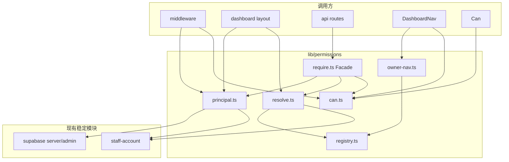

# 店内权限模块 — 架构方案（待确认）

> **状态**：架构已锁定（**2026-06-26** 与计划书同步修订 §3.4–§3.5、§6.3）  
> **产品细则**：见 [`role-permissions-plan.zh.md`](./role-permissions-plan.zh.md)（角色命名、能力清单、DB、UI 路径）  
> **策略**：全新落地，不双轨、不兼容旧硬编码（计划书 §0.6）

---

## 1. 变化点与稳定点

### 1.1 变化点（本次要动）

| 领域 | 现状 | 目标 | 变动幅度 |
|------|------|------|----------|
| **鉴权入口** | `staff-api-auth` 中 role 数组、`DashboardAccessMode`、路径辅助函数分散在 10+ 文件 | 统一 `Principal` → `Capabilities` → `can()` / `requirePermission()` | **高** |
| **菜单** | `DashboardNav` 三套硬编码数组 | 注册表 `NAV_ITEMS` + 员工 `can` / 店主 `owner_nav` | **高** |
| **路由** | `middleware` 按 owner/frontdesk/cashier 三分支 | 员工：`ROUTE_PERMISSIONS`；店主：不按侧栏拦截 | **高** |
| **API 守卫** | 每路由自选 `staffAuthFromRequest(role)` 或 role 列表 | 每路由声明 `permissionKey`，走同一 `requirePermission` | **高** |
| **可配置性** | 无 DB；角色矩阵写死在代码 | `ROLE_TEMPLATES` + `restaurant_role_permissions` + `owner_nav_preferences` | **中**（可分两批：先纯代码默认，后 DB） |
| **运营上下文** | `loadFrontdeskOperationalContext` 仅 frontdesk | `loadOperationalContext(principal)`，owner 可进运营 API | **中** |
| **UI 按钮** | implicit（能进页就能点） | 员工关键操作用 `Can`；店主页内不裁按钮 | **低–中** |
| **类型导出** | `DashboardAccessMode` 被 layout/nav 广泛引用 | 收敛为 `Principal` + `capabilities`；`accessMode` 可删或短期仅用于 i18n/telemetry | **中** |

**会持续变的（扩展点）**：`registry` 中的 `PermissionKey` 条目、`ROLE_TEMPLATES` 默认值、店主 `OWNER_NAV_CATALOG`、API/路由映射表。  
新增功能时的标准动作：**先登记 key → 挂路由/API → 改默认模板 → 单测**。

### 1.2 稳定点（不要动或仅薄封装）

| 领域 | 为何稳定 | 本模块如何处理 |
|------|----------|----------------|
| **身份来源** | Supabase Auth + `owner_id` / `restaurant_staff_accounts` | `loadPrincipal()` 复用现有查询，不新造账号体系 |
| **`StaffRole` 四枚举** | 产品已定，非权限系统职责 | 权限模块**消费** `StaffRole`，不扩展为第五员工角色 |
| **店主 ≠ staff 行** | `owner` 不在 `restaurant_staff_accounts` | `Principal` 用 tagged union，不强行统一表结构 |
| **RLS** | 表级租户隔离已成熟 | 权限模块**不替代** RLS；API `requirePermission` + 现有 service role 路径 |
| **`feature_flags`** | 店级功能开关，与角色正交 | 侧栏/按钮：`feature && permission`（或 owner nav 项） |
| **员工登录流** | `staff/login`、`post-login-redirect` | 不改；仅落地页可后续按「首个有权限菜单」优化 |
| **平台 ops** | 独立 `platform_admin_accounts` | **零耦合**；不引用 `lib/permissions` |
| **楼面页 `expectedRole`** | 仍表示「登录身份标签」 | 保留；能力检查叠加在 `staffAuth` 之上，不删除 slug+role 校验 |
| **顾客下单** | anon/append 路径 | 不在本模块范围 |

### 1.3 风险边界（架构上须显式区分）

```text
Capabilities（员工 RBAC）     → 安全边界：API 必须 enforce
Owner nav preferences        → 体验边界：只影响侧栏，不进入 requirePermission 否定逻辑
```

混淆二者会导致：要么店主被误锁死，要么员工仅靠藏菜单却仍能调 API。

---

## 2. 设计模式：要不要、用哪个

### 2.1 结论

**需要，但只采用 2 个轻量、贴合问题的模式**——不是 GoF 全家桶，也不是为了「架构好看」。

| 模式 | 是否采用 | 理由 |
|------|----------|------|
| **注册表（Registry / Catalog）** | ✅ 采用 | 权限 key、导航、路由、API 映射天然是「集中登记、多处只读引用」；避免再出现 `CHECKOUT_AUTHORIZED_*` 式散落常量 |
| **门面（Facade）** | ✅ 采用 | API route 需要重复「session → principal → capabilities → 403」；一个 `requirePermission` 收口，减少 20+ 路由复制粘贴 |
| Strategy | ❌ 不采用 | owner `*` vs staff 集合用 `if (principal.kind === 'owner')` 即可，不值得抽象策略类 |
| Chain of Responsibility | ❌ 不采用 | 覆盖优先级（员工 override → DB → 模板）用**单一纯函数** `mergeCapabilities()` 更清晰 |
| Specification | ❌ 不采用 | `Set.has` 已足够 |
| Plugin / 动态加载权限 | ❌ 不采用 | 餐饮 SaaS 权限在编译期可知；无需运行时插件 |
| CASL / 通用策略引擎 | ❌ 已否决 | 见计划书 |

### 2.2 注册表（Registry）

**职责**：模块内唯一「字典」。

- `PERMISSIONS`：key → 元数据（`group`、`labelKey`、`dangerous`、`ownerOnly`、`requires`）
- `NAV_ITEMS`、`ROUTE_PERMISSIONS`、`API_ROUTE_PERMISSIONS`：引用 key，不重复字符串
- `ROLE_TEMPLATES`、`OWNER_NAV_CATALOG`、`OWNER_NAV_DEFAULT`

**不做的**：不把 Registry 做成可运行时注册的插件容器；新增 key 仍是**改代码 + 测试**，DB 只覆盖「授予/拒绝」，不定义新 key。

### 2.3 门面（Facade）

**对外窄接口**（API / Server Component 只用这些）：

```text
loadPrincipal()           // 会话 → Principal | null
resolveCapabilities()     // Principal + 可选 DB → Set<PermissionKey | '*'>
requirePermission(req, key) // 401/403 或 { principal, capabilities }
loadOperationalContext(principal) // 原 frontdesk admin 上下文泛化
```

**对内**：`staff-api-auth` 的 slug 校验、owner fallback、admin client 创建留在 `principal.ts` / `require.ts` 内部，不暴露给业务 route。

---

## 3. 代码结构方案

### 3.1 目录（仅 1 个 lib 包 + 1 个 UI 薄层）

```text
apps/web/src/lib/permissions/
  types.ts              # Principal, Capabilities, PermissionKey（从 registry 推导）
  registry.ts           # PERMISSIONS, NAV, ROUTE, API 映射（Registry）
  role-templates.ts     # ROLE_TEMPLATES 默认值
  owner-nav.ts          # OWNER_NAV_* + resolveOwnerNavItems()
  resolve.ts            # resolveCapabilities, mergeOverrides（纯函数）
  can.ts                # can(caps, key): boolean
  principal.ts          # loadPrincipal（server / middleware 共用逻辑）
  require.ts            # requirePermission, assertCapability（Facade）
  operational-context.ts  # loadOperationalContext（替代仅 frontdesk）
  index.ts              # 对外 re-export（控制表面）

apps/web/src/components/permissions/
  PermissionsProvider.tsx   # client context: principal.kind, capabilities, ownerNavItems
  Can.tsx                   # 员工按钮；owner 恒 render children

apps/web/src/lib/permissions/__tests__/
  can.test.ts
  resolve.test.ts
  owner-nav.test.ts
  registry-integrity.test.ts  # 每个 ROUTE key ∈ PERMISSIONS；NAV ⊆ ROUTE 等
```

**刻意不建**：`permissions/strategies/`、`permissions/providers/` 接口层、`IPermissionResolver` 等。

### 3.2 模块依赖方向（单向）



**规则**：`registry` / `resolve` / `can` **不** import React、不 import route handlers。  
`staff-api-auth.ts` 在迁移完成后**删除或仅剩** `loadRestaurantBySlug` 等非权限工具（若有别处引用则迁到 `principal.ts`）。

### 3.3 核心数据流

#### 员工请求 API

```text
Request
  → loadPrincipal(req|cookies)
  → resolveCapabilities(principal, dbOverrides?)
  → can(caps, requiredKey) ?
       yes → handler
       no  → 403
```

#### 店主请求 API

```text
Request
  → loadPrincipal → kind === 'owner'
  → capabilities = '*'（跳过 DB role 表）
  → requirePermission 恒通过
  → loadOperationalContext 允许 service role
```

#### Dashboard 侧栏

```text
principal
  → owner: resolveOwnerNavItems(prefs, feature_flags)
  → staff: NAV_ITEMS.filter(item => can(caps, item.permission) && featureOk)
```

#### Middleware（员工）

```text
pathname → ROUTE_PERMISSIONS[match]
  → 无映射：按目录默认规则或 404
  → 有映射：loadPrincipal + can → redirect 至首个可访问菜单或 /auth/login
```

Middleware **不**为 owner 做 capability 拒绝（计划书 §4.1.4）。

### 3.4 与现有文件的映射（迁移时）

| 现有 | 迁移后 |
|------|--------|
| `staff-api-auth.ts` 中 `CHECKOUT_*`、`OPEN_TABLE_*`、`staffAuthFromRequestWithRoles` | 删除；逻辑进 `require.ts` + `principal.ts` |
| `dashboard-access.ts` 中 `isCashierStaffUser` 等 | 删除或仅保留 `loadDashboardAccess` 薄包装，内部改调 `loadPrincipal` |
| `dashboard-paths.ts` | 删除；由 `registry.ROUTE_PERMISSIONS` 替代 |
| `DashboardNav` 三套数组 | 删除；用 `NAV_ITEMS` + `resolveOwnerNavItems` |
| `loadFrontdeskOperationalContext` | 迁至 `operational-context.ts`，接受 `Principal` |
| `print-agent-dashboard-auth.getOwnerRestaurantId` | 删除；`requirePermission` + `print_agent.manage` / `settings.*` |
| `staff-dashboard-api.loadOwnerRestaurantWithSlug` | 同上（`settings.staff.manage` 等） |
| `dashboard-access.isActiveStaffRole` metadata 回退 | 删除；`loadPrincipal` 仅信 DB（计划书 §4.2） |

### 3.5 DB 与解析分层

```text
resolveCapabilities(staff, ctx):
  base = ROLE_TEMPLATES[staff.role]
  merged = mergeOverrides(base, restaurant_role_permissions rows)
  optional: applyStaffOverrides(merged, staff_overrides)  // P4
  return Set(merged)
```

**`mergeOverrides`（计划书 §10.2）**：

- 稀疏行：`granted: true` 加入集合，`granted: false` 从集合移除。
- 无覆盖行 → 纯 `ROLE_TEMPLATES`。
- `ownerOnly` key：写入 API 拒绝；解析时忽略误写入行。
- `restaurants.permissions_version`：角色权限 PATCH 时递增；`requirePermission` 对比 session 缓存版本，过期则 403。

**鉴权分层（勿混）**：

| 层 | 机制 |
|----|------|
| 店内 Dashboard / staff API | `requirePermission` + `Principal` |
| Print Agent 设备拉任务 | Print Agent JWT（**不**走 `print_agent.manage`） |
| 顾客下单 / enqueue token | 现有顾客会话，不在 registry |

**缓存**：解析结果可 memo 60s；`permissions_version` 变更须立即使旧 session 失效（不等 TTL）。

**不在第一期引入**：Redis、事件总线。服务端可用 `React cache()` 或请求内 memo。

### 3.6 可测试性设计

| 层级 | 测什么 | 依赖 |
|------|--------|------|
| **纯函数** | `can`、`mergeOverrides`、`resolveOwnerNavItems`、registry 完整性 | 无 DB |
| **principal** | mock Supabase client，owner/staff/disabled | 现有 test 风格 `node --import tsx --test` |
| **requirePermission** | mock principal 返回，断言 401/403 | 少量集成 |
| **E2E** | 不做全量；手工清单见计划书 §15 | — |

registry 完整性测试示例约束（写进测试即可，非新框架）：

- 每个 `ROUTE_PERMISSIONS` 的值 ∈ `PERMISSIONS`
- 每个 `API_ROUTE_PERMISSIONS` 的值 ∈ `PERMISSIONS`
- 每个 `ROLE_TEMPLATES` 的非 `*` 项 ∈ `PERMISSIONS`，且非 `ownerOnly`
- `OWNER_NAV_CATALOG` ⊆ 合法 nav permission
- `ownerOnly` key ∉ 任何 `ROLE_TEMPLATES` 员工条目

### 3.7 扩展新权限（运维约定）

1. 在 `registry.ts` 增加 `PermissionKey` 与元数据  
2. 挂 `ROUTE` / `API` / `NAV`（若需要）  
3. 更新 `ROLE_TEMPLATES` 默认值  
4. 业务 UI 用 `Can` 或 `can()`  
5. 更新 `registry-integrity.test.ts` + 计划书 §5 表格  

**不需要**改解析器接口或新增类。

---

## 4. 分期与范围（架构视角）

与计划书 P 阶段对齐，但强调**交付物是模块替换，不是补丁**：

| 批次 | 架构交付 | 删除项 |
|------|----------|--------|
| **M1 核心** | `registry` + `resolve` + `can` + `principal` + 单测 | — |
| **M2 接入面** | middleware、layout、DashboardNav、`requirePermission` 替换核心 API | `dashboard-paths`、nav 硬编码数组、role 数组常量 |
| **M3 运营** | `operational-context`、owner middleware/API | `loadFrontdeskOperationalContext` 独占逻辑 |
| **M4 配置** | DB 表 + 设置页 + `mergeOverrides` | — |
| **M5 店主导航** | `owner_nav` 读写 + my-nav 页 | — |

M1–M3 可在一次 PR 系列内完成，只要**不保留双轨**。

---

## 5. 明确不做（防止过度设计）

- 无 `PermissionService` 类层次、无 DI 容器  
- 无运行时动态注册权限插件  
- 无单独 `permissions/middleware.ts` 框架；middleware 仍驻 `supabase/middleware.ts`，只**调用** lib  
- 无员工与店主共用的「菜单配置 DSL」  
- 不把 RLS policy 生成器绑进 permissions 模块  
- 不引入新 npm 依赖  

---

## 6. 确认记录与说明

### 6.1 已确认（2026-06）

| # | 项 | 结论 |
|---|-----|------|
| 1 | 模块路径 `lib/permissions/` | ✅ 同意 |
| 3 | `staff-api-auth.ts` | ✅ 迁移完成后**删除**（slug 加载等并入 `principal.ts`） |
| 6 | `OWNER_NAV_DEFAULT` | ✅ **设置 + 部分运营项**（非 catalog 全选）；具体列表实现时在 `owner-nav.ts` 定稿 |

### 6.2 确认记录（#2 #4 #5 已确认 2026-06）

| # | 项 | 结论 |
|---|-----|------|
| 2 | 主入口 | ✅ **A + C + D**；B（`resolveCapabilities`）仅模块内部 |
| 4 | `DashboardAccessMode` | ✅ **废除**，统一 `Principal.kind` + `capabilities` |
| 5 | DB | ✅ **M1 直接 migration** 配置表；配置 UI 可后做 |

**架构状态**：§6 已全部确认，**实现前不写权限相关代码**（用户 2026-06）。

### 6.3 三个「主入口」分别做什么（#2 说明）

业务 route / layout **只应依赖**下面三个函数，而不是各自调 Supabase、查 staff 表、拼 role 数组。

#### A. `loadPrincipal()`

**一句话**：当前登录用户**是谁、属于哪家店**。

| 输入 | 输出 |
|------|------|
| Cookie / Request 中的 Supabase session | `Principal \| null` |

```text
Principal =
  | { kind: 'owner', restaurantId, userId }
  | { kind: 'staff', restaurantId, userId, role: StaffRole, staffAccountId }
  | null（未登录 / 停用 / 无效）
```

**谁用**：`dashboard/layout`、`middleware`、需要先知道「店主还是前台」的 Server Component。  
**不做**：不判断「能不能结账」——那是 B 的事。

**实施必守（计划书 §4.2）**：

- Owner 判定优先于 staff 行（`owner_id`）。
- Staff 仅当 `restaurant_staff_accounts.disabled_at IS NULL`。
- **禁止** `user_metadata.staff_role` 参与鉴权（删除现网 metadata 回退）。
- `suspended_at` 不在此函数处理；写操作由 `loadOperationalContext({ requireWritable: true })` 拦截。

---

#### B. `resolveCapabilities(principal)`（或 `requirePermission` 内部调用）

**一句话**：这名用户**具备哪些能力点**（员工 RBAC）；店主恒为 `*`。

| 输入 | 输出 |
|------|------|
| `Principal` + DB 配置（`restaurant_role_permissions`） | `Set<PermissionKey \| '*'> ` |

**谁用**：算侧栏（员工）、`Can` 组件、`middleware` 路由拦截、**在 requirePermission 内部**。  
业务 handler **一般不要直接调**——用 C 更省事。

---

#### C. `requirePermission(req, permissionKey)`

**一句话**：API 路由的**守门员**——未登录 401、员工无权限 403、通过则继续。

| 输入 | 输出 |
|------|------|
| `Request` + 一个 key（如 `'checkout.confirm_payment'`） | `{ principal, capabilities }` **或** `NextResponse` 错误 |

内部顺序：`loadPrincipal` → `resolveCapabilities` → `can(caps, key)` →（可选）校验 `permissions_version`。

**谁用**：几乎所有 `apps/web/src/app/api/**` 写操作/敏感读。  
**示例**：

```text
// 路由里理想形态（示意，非实现）
const auth = await requirePermission(req, 'checkout.confirm_payment');
if (auth instanceof NextResponse) return auth;
// auth.principal, auth.capabilities 交给 handler
```

---

#### D. `loadOperationalContext(principal)`（第四个，但属「上下文」非「鉴权」）

**一句话**：前台/店主做**运营写操作**时，拿到 **service role 的 admin client + restaurantId**（原 `loadFrontdeskOperationalContext` 泛化）。

| 输入 | 输出 |
|------|------|
| `Principal`（owner 或具备相应能力的 staff） | `{ admin, restaurantId }` **或** 403 |

**谁用**：`/api/dashboard/tables`、`close-table-session` 等需要 bypass RLS 的店内 API。  
**与 C 的关系**：先 `requirePermission`（能力），再 `loadOperationalContext`（拿 admin）；不要合并成一个「万能函数」，否则鉴权与数据访问耦死。

---

**#2 建议你怎么答**：

- 若同意「API 只认 `requirePermission` + 运营 API 再加 `loadOperationalContext`」→ 主入口 = **A + C + D**（B 作为内部步骤，不强制业务方调用）。
- `layout` / `middleware` 用 **A**，必要时对员工再调 **B** 算侧栏。

### 6.4 `DashboardAccessMode` vs `Principal.kind`（#4）

| | `DashboardAccessMode`（现网） | `Principal.kind` + `staff.role`（建议） |
|--|------------------------------|----------------------------------------|
| 表达力 | 仅 `'owner' \| 'cashier' \| 'frontdesk'` | `owner` **或** `staff` + 四角色之一 |
| 厨房/服务员 | **进不了** Dashboard 模式（另走路由） | 同样不进 Dashboard；`Principal` 在楼面页解析 |
| 与权限关系 | 间接：mode 推导能进哪些**路径** | 直接：`capabilities` 推导菜单/API |
| 扩展 | 加角色要加 mode 或继续硬编码 | 加能力只改 registry + 模板 |
| 问题 | mode 与真实权限**不同步**（同名不同义） | 身份（Principal）与授权（Capabilities）分离 |

**建议**：**删除 `DashboardAccessMode`**，统一 `Principal`：

- `principal.kind === 'owner'` → 替代 `access.mode === 'owner'`
- `principal.kind === 'staff' && principal.role === 'frontdesk'` → 替代 `access.mode === 'frontdesk'`
- 侧栏/路由看 `capabilities`，不再看 mode

**迁移期唯一要注意**：`layout.tsx`、`checkout/page.tsx` 里 `showPrinterSettings={access.mode === 'frontdesk'}` 改为 `can(caps, 'checkout.printer_settings')` 或 owner 恒 true。

### 6.5 为何文档曾写「M1–M3 零 DB」？能否直接上配置表？（#5）

**曾建议分期的原因（非技术必须）**：

- 先验证 registry + 全链路替换，减少「改代码 + 改表 + 做配置页」同 PR 爆炸；
- 零 DB 阶段可用 `ROLE_TEMPLATES` 纯代码默认值跑通测试。

**你们可以直上的理由**：

- 已明确**不兼容旧数据**、不做双轨；
- 配置表空表 + 代码默认模板 = 行为与「零 DB」一致（`mergeOverrides` 无行时用 `ROLE_TEMPLATES`）；
- 一次 migration 避免二次改 `resolveCapabilities` 签名。

**建议**：**直接上配置表**（与 M1 同批 migration）：

- `restaurant_role_permissions`
- `restaurants.owner_nav_preferences`（或独立列）
- `restaurants.permissions_version`（integer，默认 0）

配置页 UI 仍可后做：表先存在，店主暂时只享受 `ROLE_TEMPLATES` + `OWNER_NAV_DEFAULT`，员工权限由代码默认矩阵生效，直到 `/settings/roles` 上线。

**风险**：多一张空表 + RLS policy 要写对（仅 owner 写本店）。收益大于分期。

### 6.6 `OWNER_NAV_DEFAULT` 范围（#6 已定方向）

店主首次侧栏（DB 无 `owner_nav_preferences` 时）建议默认项：

| 包含 | PermissionKey |
|------|----------------|
| 设置 | `dashboard.settings.view` |
| 运营（部分） | `dashboard.checkout.view`、`dashboard.tables.view`、`dashboard.unpaid_orders.view`（实现时可微调） |
| **不含** | 概览、订单历史、内嵌服务员看板、厨房快捷（需店主在「我的导航」里自行打开） |

与「catalog 全选」相比：默认更克制，符合「店主以配置为主、运营入口按需打开」。  
**登录落地页**仍为 `/dashboard/settings`（与侧栏默认含运营项不矛盾，见计划书 §13）。

**`frontdesk` 默认模板**：须含 `dashboard.waiter_board.view`（现网内嵌服务员看板）；不含 `floor.waiter_board.view`（楼面独立页）。见计划书 §6。

---

> **2026-06**：§6 已全部确认，架构已锁定。  
> **2026-06-26**：对照现网代码审查，计划书 §4.2 / §7.3 / §10.2 / §11 / §13 与本文 §3.4–§3.5 / §6.3 已同步修订。

---

## 7. 文档关系

| 文档 | 职责 |
|------|------|
| `role-permissions-plan.zh.md` | 产品、角色命名、能力清单、UI 路径、DB DDL |
| **本文** | 架构：变与不变、模式、目录、依赖、测试、确认项 |
| `ai-schema.md` | 表结构（M1 migration 时更新：`owner_nav_preferences`、`restaurant_role_permissions`、`permissions_version`） |

确认 §6 后，实现顺序：**registry → resolve/can → principal/require → 替换调用方 → 删旧代码 → 单测**。
