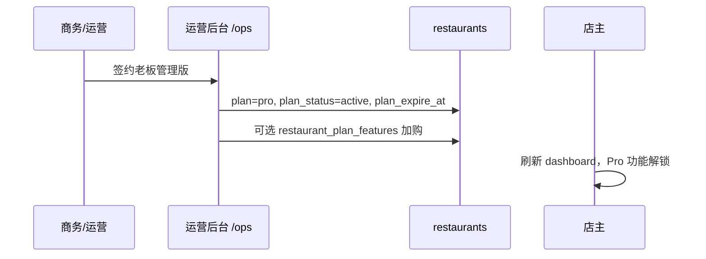

# Buffet 点餐系统：收费套餐与功能分层设计 V1

> **状态**：需求设计稿（2026-06-26）  
> **受众**：产品、研发、运营  
> **关联文档**：[`role-permissions-architecture.zh.md`](./role-permissions-architecture.zh.md)、[`restaurant-features.zh.md`](./restaurant-features.zh.md)、[`platform-admin-plan.zh.md`](./platform-admin-plan.zh.md)、[`development-backlog.zh.md`](./development-backlog.zh.md)  
> **说明**：本文中的「套餐 / Plan」指 **SaaS 订阅分层**；与 [`buffet-pricing-design.zh.md`](./buffet-pricing-design.zh.md) 中的「自助餐人头定价」无关。

---

## 1. 背景与目标

### 1.1 背景

Mesa 当前定位为 Buffet 餐厅的点餐、开台、结账与桌台管理工具。随着经营分析、异常风控、报表导出、老板日报、多门店管理等能力逐步落地，这些能力面向**老板的经营管理价值**，适合作为收费分层，而非拆碎单卖。

### 1.2 设计目标

| # | 目标 | 验收口径 |
|---|------|----------|
| G1 | 不影响基础营业流程 | 基础版可完整完成开台→点单→结账→关台，无强制弹窗 |
| G2 | 老板清楚理解付费价值 | 升级页用经营语言描述收益，非技术 Feature 名 |
| G3 | 套餐区分客户规模 | 三档套餐覆盖单店 / 单店老板 / 连锁 |
| G4 | 为 SaaS 化预留技术基础 | Plan、Feature、Guard、Gate 统一抽象 |
| G5 | 避免碎片化收费 | 按套餐打包，不按单功能标价 |
| G6 | 支持先手动开通 | 运营后台或 SQL 改 plan，无需 Stripe |
| G7 | 角色权限与套餐权限正交 | API 同时校验 `permission` 与 `planFeature` |

### 1.3 非目标（第一版不做）

- Stripe / 自动扣费 / 发票
- 离线授权码文件与在线激活
- 按门店数量的动态计费引擎
- 把基础登录安全、金额计算、订单持久化作为付费项

---

## 2. 收费原则

### 2.1 三层价值模型

```text
基础营业能力  → 保证餐厅能正常开台、点单、结账（不宜过度收费）
老板管理能力  → 看经营、防漏单、控风险（主推收费）
连锁经营能力  → 多门店、员工分析、总部管控（高阶收费）
```

### 2.2 基础营业：不应拆分收费

以下能力属于点餐系统本体，**默认包含在最低档套餐**：

- 开台、加菜、转台、并台、结账、关台
- 桌位配置、基础菜单管理
- 结账请求、活跃订单、基础订单历史
- 固定角色账号登录
- 当天数据概览（今日营业额 / 单量等摘要，非趋势图）

若基础能力被锁付费，会降低成交率且损害「系统完整」感知。

### 2.3 老板管理：适合收费

| 能力簇 | 老板感知价值 |
|--------|--------------|
| 异常操作审计 | 少漏单、少乱删、少乱打折；知道谁做了敏感操作 |
| 趋势分析 | 知道生意变好还是变差；哪些菜消耗高 |
| 老板日报 / 报表导出 | 不用每天翻订单；月底对账省时 |

### 2.4 安全底线：不能收费

以下属于系统基础责任，**任何套餐均包含**：

- 基础登录安全、租户 RLS、基础权限控制
- 金额计算准确、订单不丢失、Bug 修复
- 写入 `operation_logs` 的基础操作记录（与「高级异常审计 UI」区分）

### 2.5 不做碎片化收费

❌ 趋势单独卖、异常单独卖、导出单独卖  
✅ 打包为 **基础营业版 / 老板管理版 / 连锁经营版**

---

## 3. 套餐定义

### 3.1 套餐一览

| 内部枚举 | 中文名 | 定位 | 目标客户 |
|----------|--------|------|----------|
| `basic` | 基础营业版 | 完成日常营业 | 单店、预算敏感、仅需点餐结账 |
| `pro` | 老板管理版 | **主推**；看经营、控风险 | 单店 Buffet 老板 |
| `business` | 连锁经营版 | 多店对比、员工分析 | 连锁、需总部管控 |

> **与现有 schema 对齐**：`restaurants.plan` 当前为 `free \| pro`（见 `docs/ai-schema.md`）。落地时建议：
>
> - `free` → 映射为 `basic`（基础营业版），保留列值 `free` 或 migration 重命名为 `basic`
> - `pro` → 老板管理版（列值可继续用 `pro`）
> - 新增 `business` → 连锁经营版（需 migration 扩展 check constraint）
>
> 本文档下文统一用 **`basic` / `pro` / `business`** 表述产品语义；实现层可用 DB 实际枚举并在 `FeatureService` 内归一化。

### 3.2 基础营业版（`basic`）

**包含**：桌台管理；开台 / 加菜 / 转台 / 并台 / 结账 / 关台；结账请求；活跃订单；基础订单历史；基础菜单管理；固定角色账号；今日数据概览。

**不包含**：异常操作审计页；趋势分析；菜品消耗分析；老板日报；报表导出；高级订单筛选；多门店；自定义角色权限。

### 3.3 老板管理版（`pro`）

包含基础营业版全部能力，并增加：

- 异常操作审计（折扣 / 删菜 / 未付款关台记录；确认 / 忽略 / 备注）
- 营业额 / 客流 / 人均 / 菜品消耗趋势；高消耗 Top 10
- 高级订单筛选
- 老板经营日报
- 基础报表导出（营业额、异常操作、菜品消耗、订单）

**推荐话术**：「基础版帮你完成营业；老板管理版帮你看清每天赚多少、哪里可能漏钱、哪些菜消耗最多。」

### 3.4 连锁经营版（`business`）

包含老板管理版全部能力，并增加：

- 多门店管理与多店对比（营业额、菜品消耗、异常汇总）
- 员工操作分析、员工异常排行
- 自定义角色权限（依赖 [`role-permissions-plan.zh.md`](./role-permissions-plan.zh.md) 落地）
- 月度经营报告、高级报表导出
- 数据备份策略、远程维护支持（运营流程，非纯软件开关）

---

## 4. 功能分层矩阵

| 功能 | basic | pro | business | Plan Feature Key |
|------|:-----:|:---:|:--------:|------------------|
| 开台 / 加菜 / 结账 | ✅ | ✅ | ✅ | `BASIC_TABLE_OPERATION` |
| 转台 / 并台 / 关台 | ✅ | ✅ | ✅ | `BASIC_TABLE_OPERATION` |
| 桌台管理 | ✅ | ✅ | ✅ | `BASIC_TABLE_OPERATION` |
| 结账请求 / 活跃订单 | ✅ | ✅ | ✅ | `BASIC_TABLE_OPERATION` |
| 基础订单历史 | ✅ | ✅ | ✅ | `BASIC_ORDER_HISTORY` |
| 基础菜单管理 | ✅ | ✅ | ✅ | `BASIC_MENU_MANAGEMENT` |
| 固定角色账号 | ✅ | ✅ | ✅ | （角色体系，非 Plan Feature） |
| 今日数据概览 | ✅ | ✅ | ✅ | `BASIC_TODAY_OVERVIEW` |
| 异常操作审计 | ❌ | ✅ | ✅ | `ABNORMAL_OPERATIONS` |
| 折扣 / 删菜 / 未付款关台记录 | ❌ | ✅ | ✅ | `ABNORMAL_OPERATIONS` |
| 老板确认 / 忽略异常 | ❌ | ✅ | ✅ | `ABNORMAL_OPERATIONS` |
| 营业额 / 客流 / 人均趋势 | ❌ | ✅ | ✅ | `TREND_ANALYTICS` |
| 菜品消耗趋势 / Top 10 | ❌ | ✅ | ✅ | `ITEM_CONSUMPTION_ANALYTICS` |
| 老板经营日报 | ❌ | ✅ | ✅ | `OWNER_DAILY_REPORT` |
| 基础报表导出 | ❌ | ✅ | ✅ | `REPORT_EXPORT` |
| 高级订单筛选 | ❌ | ✅ | ✅ | `ADVANCED_ORDER_HISTORY` |
| 员工异常排行 | ❌ | 可选¹ | ✅ | `EMPLOYEE_OPERATION_ANALYTICS` |
| 自定义角色权限 | ❌ | ❌ | ✅ | `CUSTOM_ROLE_PERMISSION` |
| 多门店管理 / 对比 | ❌ | ❌ | ✅ | `MULTI_STORE_MANAGEMENT` |
| 月度经营报告 | ❌ | 可选¹ | ✅ | `MONTHLY_BUSINESS_REPORT` |
| 高级数据导出 | ❌ | 可选¹ | ✅ | `ADVANCED_REPORT_EXPORT` |

¹ **可选**：第一版可不单独拆卖；默认 `pro` 不含，`business` 含。若需给 `pro` 客户加购，通过 `restaurant_plan_features` 单行开通（见 §6）。

---

## 5. 与现有「功能开关」的关系

系统已有 **店主自助功能开关**（`restaurants.feature_flags`），见 [`restaurant-features.zh.md`](./restaurant-features.zh.md)：

| 维度 | `feature_flags` | Plan Entitlements |
|------|-----------------|-------------------|
| 控制对象 | 可选产品模块（如厨房看板、账单打印） | 订阅套餐能力 |
| 谁修改 | 店主在设置页 | 运营手动 / 未来支付 webhook |
| 典型键 | `kitchen_board`, `bill_receipt_print` | `ABNORMAL_OPERATIONS`, `TREND_ANALYTICS` |
| 与角色关系 | 侧栏：`flags && permission` | 访问：`planFeature && permission` |

**最终门控公式**（与权限架构一致）：

```text
canAccessUI     = hasPermission(principal, permissionKey)
                 && hasPlanFeature(restaurantId, planFeatureKey)
                 && isRestaurantFeatureEnabled(flags, optionalFlagKey)  // 若该入口还绑定了 feature_flags

canAccessAPI    = authenticated
                 && hasPermission(principal, permissionKey)
                 && assertPlanFeature(restaurantId, planFeatureKey)
```

**禁止**：用 `if (user.role === 'owner')` 代替套餐判断。

---

## 6. 数据模型

### 6.1 `restaurants` 扩展字段

| 字段 | 类型 | 说明 |
|------|------|------|
| `plan` | text | `free`/`basic` \| `pro` \| `business`（以实现 migration 为准） |
| `plan_status` | text | `active` \| `expired` \| `trial` \| `disabled` |
| `plan_expire_at` | timestamptz nullable | 到期时间；`null` 表示不限期（早期手动客户） |

**状态语义**：

| plan_status | 行为 |
|-------------|------|
| `active` | 按 plan 映射的 entitlements 生效 |
| `trial` | 视同 `pro`（或配置的试用套餐），`plan_expire_at` 到期后转 `expired` |
| `expired` | 降级为 `basic` entitlements；**保留历史数据**，锁定高级页与 API |
| `disabled` | 与 `suspended_at` 配合；全店只读或不可营业（产品另定，见运营后台） |

### 6.2 `restaurant_plan_features`（店铺级功能覆盖）

用于试用、加购、人工运营调整。

| 列 | 说明 |
|----|------|
| `id` | uuid PK |
| `restaurant_id` | FK → restaurants |
| `feature_key` | Plan Feature 枚举 |
| `enabled` | boolean |
| `expire_at` | timestamptz nullable |
| `created_at` / `updated_at` | |

**解析优先级**（高 → 低）：

1. `plan_status === disabled` → 拒绝（除基础只读策略外）
2. `plan_status === expired` → 仅 basic entitlements
3. `restaurant_plan_features` 行级覆盖（enabled + 未过期）
4. `plan_features` 静态配置（代码或 DB）
5. 默认 basic

### 6.3 `plan_features` 配置（第一版放代码）

建议 `apps/web/src/lib/plan-features.ts`（`@mesa/shared` 若 ops/web 共用）：

```ts
export const PLAN_FEATURES: Record<RestaurantPlan, readonly PlanFeatureKey[]> = {
  basic: [
    'BASIC_TABLE_OPERATION',
    'BASIC_ORDER_HISTORY',
    'BASIC_MENU_MANAGEMENT',
    'BASIC_TODAY_OVERVIEW',
  ],
  pro: [
    /* basic 全部 + */
    'ABNORMAL_OPERATIONS',
    'TREND_ANALYTICS',
    'OWNER_DAILY_REPORT',
    'REPORT_EXPORT',
    'ADVANCED_ORDER_HISTORY',
    'ITEM_CONSUMPTION_ANALYTICS',
  ],
  business: [
    /* pro 全部 + */
    'EMPLOYEE_OPERATION_ANALYTICS',
    'CUSTOM_ROLE_PERMISSION',
    'MULTI_STORE_MANAGEMENT',
    'MONTHLY_BUSINESS_REPORT',
    'ADVANCED_REPORT_EXPORT',
  ],
};
```

### 6.4 `subscriptions`（P2，第一版可不做）

| 列 | 说明 |
|----|------|
| `restaurant_id`, `plan`, `status` | |
| `start_at`, `end_at` | |
| `payment_provider`, `external_subscription_id` | Stripe 等 |

---

## 7. 技术架构

### 7.1 核心模块

| 模块 | 职责 | 建议路径 |
|------|------|----------|
| `PlanFeatureKey` / `RestaurantPlan` | 类型与枚举 | `src/lib/plan-features.ts` |
| `FeatureService` | `canUseFeature`, `listFeatures`, `normalizePlan` | `src/lib/plan-feature-service.ts` |
| `assertPlanFeature` | API 门控，失败抛 `PlanFeatureRequiredError` | 同上或 `plan-feature-guard.ts` |
| `loadRestaurantPlanContext` | 读 plan + overrides + expire | server helper |
| `usePlanFeature` | 客户端 hook | `src/hooks/usePlanFeature.ts` |
| `PlanFeatureGate` | 无权限时渲染升级页 | `src/components/dashboard/PlanFeatureGate.tsx` |
| `UpgradePrompt` | 统一升级文案组件 | `src/components/dashboard/UpgradePrompt.tsx` |

### 7.2 后端校验顺序

```text
1. 认证（session / staff token）
2. 租户上下文（restaurant_id）
3. 角色权限 requirePermission(principal, key)
4. 套餐权限 assertPlanFeature(restaurantId, featureKey)
5. 业务逻辑
```

### 7.3 错误契约

| HTTP | code | 场景 |
|------|------|------|
| 401 | `unauthenticated` | 未登录 |
| 403 | `forbidden` | 角色无 permission |
| 403 | `plan_feature_required` | 角色有权限但套餐不含；body 含 `feature`, `required_plan`, `current_plan` |
| 403 | `plan_expired` | 套餐已过期 |
| 503 | `plan_context_unavailable` | 读 plan 失败 |

前端：`plan_feature_required` → 升级页；`forbidden` → 无权限页（不推销升级）。

### 7.4 前端展示策略

**菜单**：付费项**可见**，标 `Pro` / `Business` 角标；点击后：

- 有 permission + 有 feature → 正常页
- 有 permission + 无 feature → `UpgradePrompt`
- 无 permission → `notFound` 或统一无权限（与现店主-only 页一致）

**示例侧栏**（老板管理版入口）：

```text
经营分析
  ├─ 数据概览
  ├─ 趋势分析 Pro
  ├─ 异常操作 Pro
  └─ 报表导出 Pro
```

**升级页文案要点**（i18n：`planUpgrade.*`）：

- 标题：该功能属于老板管理版
- 列表：具体能力（趋势、异常、日报、导出）
- 价值句：少漏单、少乱删、快速知道每天赚多少
- CTA：`了解老板管理版`（第一版链到联系运营 / 邮件，非支付）

**打扰策略**：仅在用户**主动点击**付费功能时展示升级页；不在每次结账、点单后弹窗。

---

## 8. 功能与路由 / API 映射

### 8.1 当前实现状态（2026-06-26）

| 能力 | 页面 | API | 角色门控 | 套餐门控 |
|------|------|-----|----------|----------|
| 异常操作审计 | `/dashboard/abnormal-operations` | `/api/dashboard/abnormal-operations` | 仅 owner ✅ | ❌ 待做 |
| 趋势分析 | 未建 | 未建 | — | — |
| 菜品消耗分析 | 未建 | 未建 | — | — |
| 老板日报 | 未建 | 未建 | — | — |
| 报表导出 | 未建 | 未建 | — | — |
| 今日概览 | dashboard 首页 | 现有统计 API | 按角色 | 拟保持 basic |

### 8.2 目标 API 清单（需 `assertPlanFeature`）

| Feature Key | 方法 | 路径（建议） | Permission（员工 RBAC 落地后） |
|-------------|------|--------------|----------------------------------|
| `ABNORMAL_OPERATIONS` | GET | `/api/dashboard/abnormal-operations` | `abnormal_operations.view` |
| `ABNORMAL_OPERATIONS` | GET/PATCH | `/api/dashboard/abnormal-operations/[id]` | `abnormal_operations.manage` |
| `TREND_ANALYTICS` | GET | `/api/dashboard/analytics/trends` | `analytics.trends.view` |
| `ITEM_CONSUMPTION_ANALYTICS` | GET | `/api/dashboard/analytics/item-consumption` | `analytics.consumption.view` |
| `OWNER_DAILY_REPORT` | GET | `/api/dashboard/owner-daily-report` | `analytics.daily_report.view` |
| `REPORT_EXPORT` | GET | `/api/dashboard/reports/export/*` | `reports.export` |

> 写入 `operation_logs` / `abnormal_operations` 的**采集**在 basic 也继续执行（安全底线）；**查询 UI 与导出**受 `ABNORMAL_OPERATIONS` 门控。

### 8.3 页面级门控

| 页面 | permission | planFeature | basic 用户 |
|------|------------|-------------|------------|
| 异常操作 | owner（现）/ `abnormal_operations.view` | `ABNORMAL_OPERATIONS` | UpgradePrompt |
| 趋势分析 | `analytics.trends.view` | `TREND_ANALYTICS` | UpgradePrompt |
| 报表导出入口 | `reports.export` | `REPORT_EXPORT` | 点击导出时 UpgradePrompt |
| 老板日报 | `analytics.daily_report.view` | `OWNER_DAILY_REPORT` | 不生成 / 不展示 |

---

## 9. 试用与到期

### 9.1 试用策略

| 项 | 建议 |
|----|------|
| 周期 | 7 或 14 天 |
| 开通方式 | 运营设 `plan_status=trial`，`plan=pro`，`plan_expire_at` |
| 试用范围 | pro 全部 entitlements |
| 结束行为 | `plan_status→expired`；历史数据保留；高级页锁定 |

### 9.2 到期提示

| 时机 | UI |
|------|-----|
| 到期前 7 天 | Dashboard 横幅（店主可见，可关闭） |
| 到期当天 | 横幅 + 高级菜单仍可见但进页为升级/续费说明 |
| 过期后 | 高级 API 返回 `plan_expired` |

### 9.3 降级

`pro` → `basic`：**不删数据**；异常记录、历史报表数据只读封锁；恢复订阅后立即可查。

---

## 10. 运营开通流程（第一版）



**手动 SQL 示例**（仅运维，非产品路径）：

```sql
UPDATE restaurants
SET plan = 'pro',
    plan_status = 'active',
    plan_expire_at = '2026-12-31T23:59:59Z'
WHERE id = '<restaurant_uuid>';
```

运营后台 UI：见 [`platform-admin-plan.zh.md`](./platform-admin-plan.zh.md) §4.3「Plan 与功能开关」。

---

## 11. 定价与商业化（原则级）

第一版**不固定公开价**，人工报价。定性分档：

| 套餐 | 定价策略 |
|------|----------|
| 基础营业版 | 低价或免费试用 |
| 老板管理版 | 主推订阅 |
| 连锁经营版 | 按门店数报价 |

部署形态：

- **SaaS 在线**：月/年订阅；按店计费
- **离线/私有化**：安装费 + 年维护 + 功能授权（见 [`local-on-premise-deployment-plan.md`](./local-on-premise-deployment-plan.md)）；授权码为 P2

---

## 12. 用户故事（验收用）

### US-1 基础版正常营业

**作为** 基础版店主  
**我希望** 完成开台、点单、结账  
**以便** 不被付费弹窗打断  

**验收**：全流程无 `plan_feature_required`；今日概览可用；异常审计菜单可显但点进为升级页。

### US-2 老板查看异常

**作为** 老板管理版店主  
**我希望** 查看折扣与删菜记录并确认异常  
**以便** 减少漏单  

**验收**：`GET /api/dashboard/abnormal-operations` 200；basic 同接口 403 + `plan_feature_required`。

### US-3 试用到期

**作为** 试用即将到期的店主  
**我希望** 看到续费提示且到期后仍能看基础营业  
**以便** 不中断门店营业  

**验收**：到期后趋势/异常 API 403；订单与结账 API 正常；历史异常数据未删除。

### US-4 运营开通

**作为** 平台运营  
**我希望** 在运营后台修改餐厅套餐与到期日  
**以便** 无需改代码或 SQL  

**验收**：操作写入审计日志；店主下次请求读到新 entitlements。

### US-5 API 不可绕过

**作为** 恶意用户  
**我希望**（攻击面）用直接调 API 绕过 UI  
**结果** 服务端仍拒绝  

**验收**：curl 无 token 401；basic 店主 token 调 analytics 403。

---

## 13. 开发优先级

### P0 — 最小可用收费架构

| # | 任务 | 产出 |
|---|------|------|
| 1 | migration：`plan_status`, `plan_expire_at`；`plan` 支持 `business` | SQL + `ai-schema.md` |
| 2 | `plan-features.ts` 配置表 | 代码 |
| 3 | `FeatureService` + `assertPlanFeature` | 代码 + 单测 |
| 4 | 异常操作 API / 页接入门控 | 首个付费功能样板 |
| 5 | `PlanFeatureGate` + `UpgradePrompt` + 侧栏 Pro 标 | UI |
| 6 | i18n 升级文案 zh/en/pt | messages |

### P1 — 体验与运营

- 试用 `trial` 状态与到期横幅
- 运营后台改 plan（`apps/ops`）
- 趋势分析 / 日报 / 导出页面与 API（功能本身 + 门控）
- `restaurant_plan_features` 表与合并逻辑

### P2 — 商业化扩展

- Stripe 订阅、`subscriptions` 表
- 离线授权码
- 多门店 `business` 功能本体
- 发票、按店计费

---

## 14. 风险与约束

| 风险 | 缓解 |
|------|------|
| 核心营业被锁 | basic entitlements 显式清单 + 回归用例 |
| 判断散落各路由 | 强制走 `assertPlanFeature`；禁止内联 `plan === 'pro'` |
| 仅前端隐藏 | 所有付费 API 后端校验 |
| 与 `feature_flags` 混淆 | 文档 + 命名：`PlanFeatureKey` vs `RestaurantFeatureKey` |
| 与 RBAC 混淆 | 权限架构 `feature && permission`；员工即使有权限也需套餐 |
| 过期删数据 | 明确只锁访问，不 DELETE |
| `free`/`pro` 历史数据 | migration 脚本：`free`→`basic` 语义，默认 entitlements 不变 |

---

## 15. 第一版落地清单（推荐）

1. `restaurants` 增加 `plan_status`、`plan_expire_at`；扩展 `plan` 枚举。
2. 代码定义 `PLAN_FEATURES`。
3. 实现 `FeatureService` / `assertPlanFeature`。
4. **异常操作**作为首个接入门控的模块（页面 + 两条 API）。
5. 侧栏 Pro 标识 + `UpgradePrompt`。
6. 运营手动改库或 ops UI 开通；**不接入支付**。
7. 单测：`resolveFeatures(trial)`、`assertPlanFeature` 拒绝 basic。

---

## 16. 结论

收费分层围绕三档套餐：**基础营业 / 老板管理 / 连锁经营**。第一阶段主推 **老板管理版**，核心卖点为 **异常操作审计、趋势分析、老板日报、报表导出**。

技术上必须统一 **Plan + Feature + FeatureService + Guard + Gate**，且：

```text
最终访问 = 角色权限 ∩ 套餐权限 [∩ 可选 feature_flags]
```

产品卖点：**基础版完成营业；老板管理版少亏钱、看清经营；连锁版管多店与员工。**

---

## 修订记录

| 版本 | 日期 | 说明 |
|------|------|------|
| 1.0 | 2026-06-26 | 初版：整合业务方案，对齐现有 schema / 权限架构 / 异常操作实现状态，补充数据模型、API 契约、用户故事与 P0 清单 |
